# KubeMin-Cli 架构图

本文档通过 Mermaid 图表可视化 KubeMin-Cli 的系统架构、组件关系和数据流。

## 目录

- [1. 系统整体架构](#1-系统整体架构)
- [2. 分层架构](#2-分层架构)
- [3. 核心组件关系](#3-核心组件关系)
- [4. 工作流引擎架构](#4-工作流引擎架构)
- [5. 数据模型关系](#5-数据模型关系)
- [6. API 请求处理流程](#6-api-请求处理流程)
- [7. 工作流执行流程](#7-工作流执行流程)
- [8. Leader 选举与高可用](#8-leader-选举与高可用)
- [9. Traits 处理流程](#9-traits-处理流程)
- [10. 部署架构](#10-部署架构)

---

## 1. 系统整体架构

KubeMin-Cli 作为 Kubernetes 应用管理平台，与多个外部系统交互：

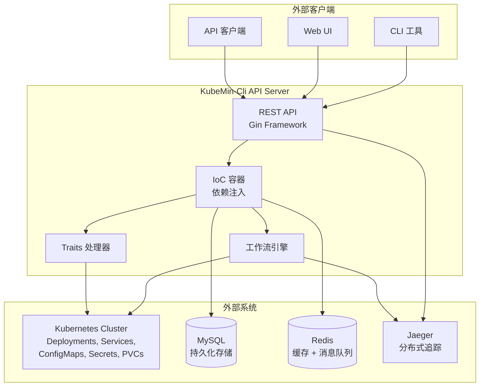

### 系统交互说明

| 外部系统 | 用途 | 协议 |
|----------|------|------|
| Kubernetes | 部署和管理工作负载 | client-go |
| MySQL | 存储应用、工作流、组件等数据 | GORM |
| Redis | 分布式缓存 + Redis Streams 消息队列 | go-redis |
| Jaeger | 分布式追踪收集 | OpenTelemetry |

---

## 2. 分层架构

项目采用 DDD（领域驱动设计）风格的分层架构：

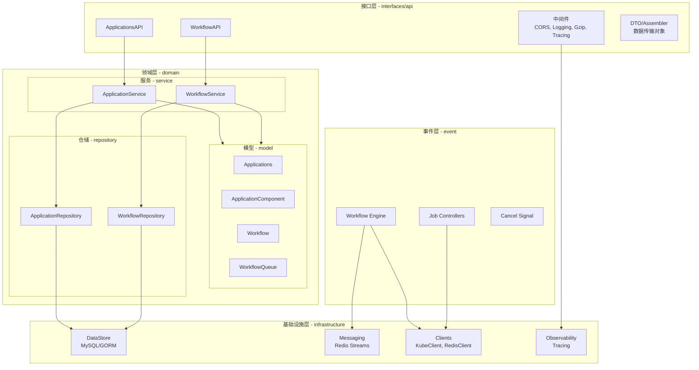

### 层级职责

| 层级 | 目录 | 职责 |
|------|------|------|
| 接口层 | `interfaces/api/` | HTTP 路由、请求验证、响应序列化 |
| 领域层 | `domain/` | 业务逻辑、领域模型、数据仓储 |
| 事件层 | `event/` | 工作流调度、任务执行、事件处理 |
| 基础设施层 | `infrastructure/` | 数据库、缓存、消息队列、外部客户端 |

---

## 3. 核心组件关系

展示主要组件之间的依赖和调用关系：

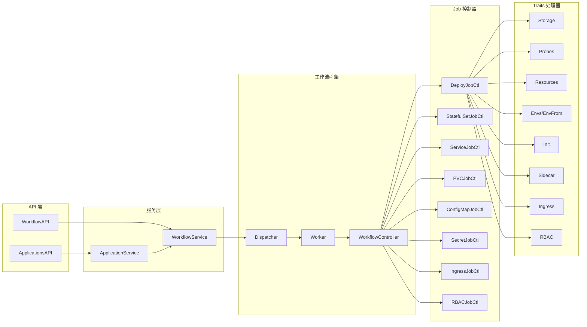

---

## 4. 工作流引擎架构

工作流引擎的内部组件和执行模式：

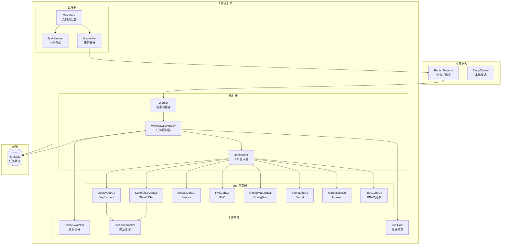

### 双模式执行

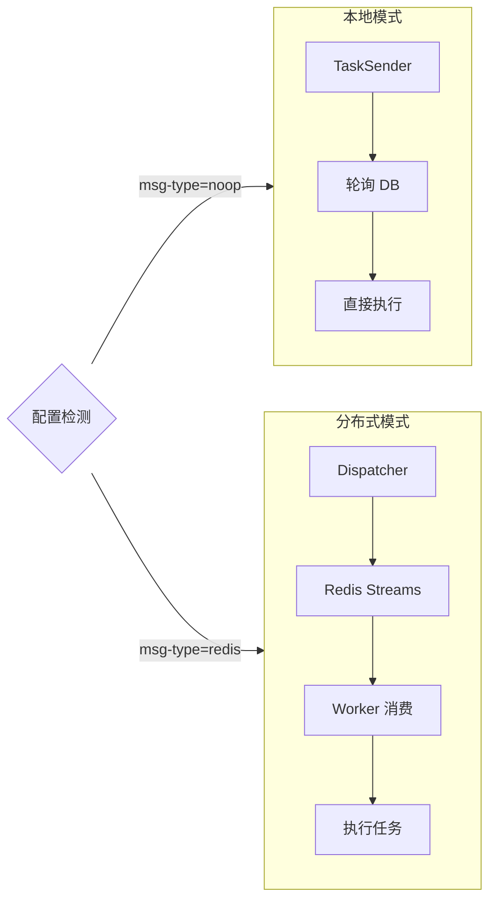

---

## 5. 数据模型关系

核心数据模型的 ER 关系图：

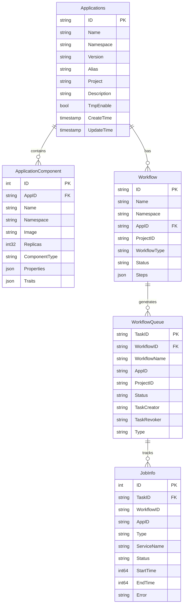

### 状态流转

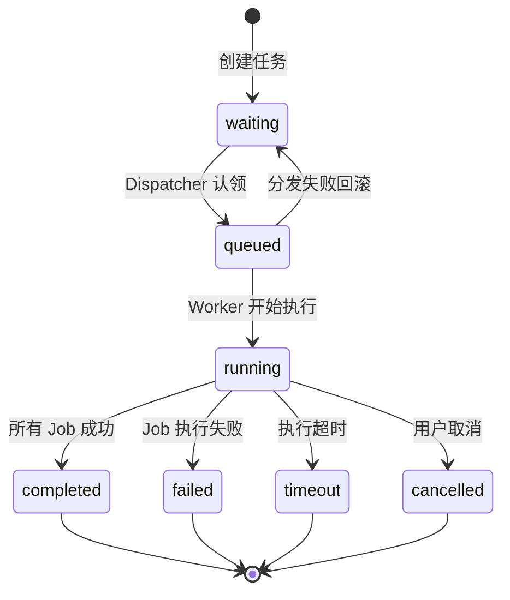

---

## 6. API 请求处理流程

一个典型的应用创建请求的完整处理流程：

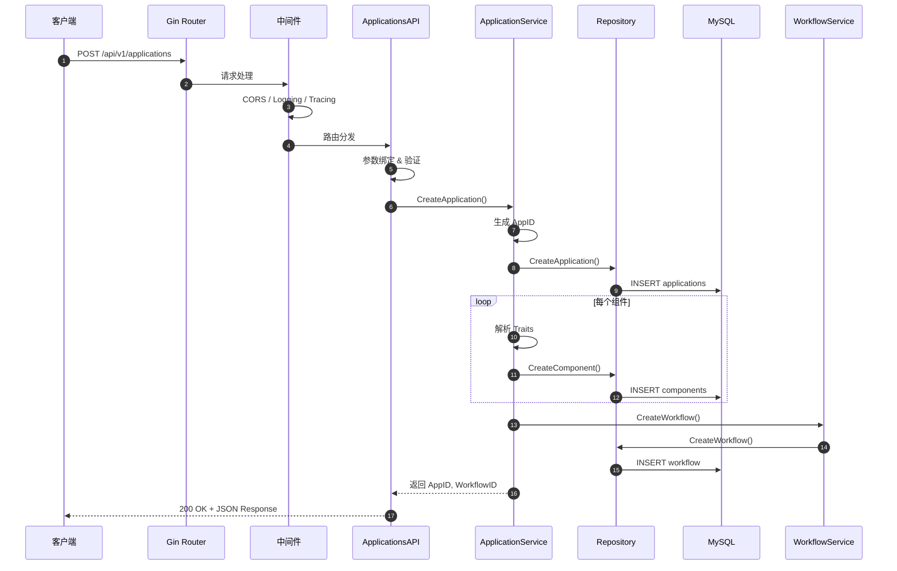

---

## 7. 工作流执行流程

从触发工作流到 Kubernetes 资源部署的完整流程：

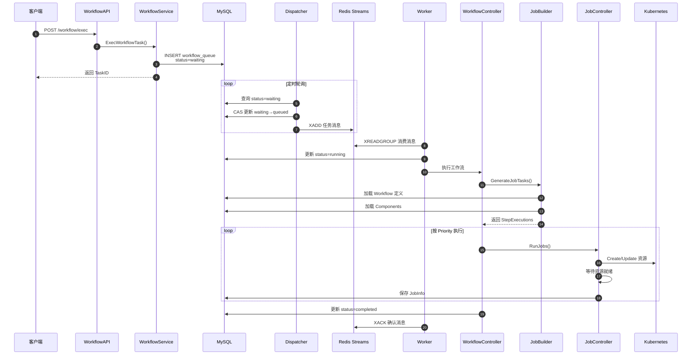

### Job 优先级执行顺序

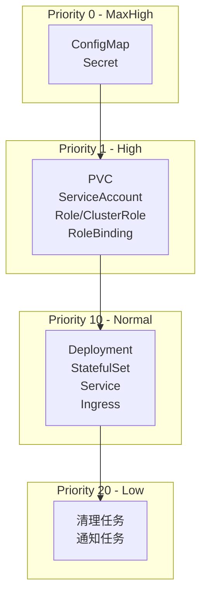

---

## 8. Leader 选举与高可用

多实例部署时的 Leader 选举和角色分配：

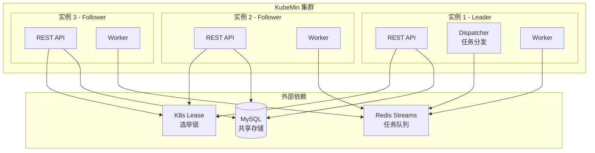

### Leader 选举流程

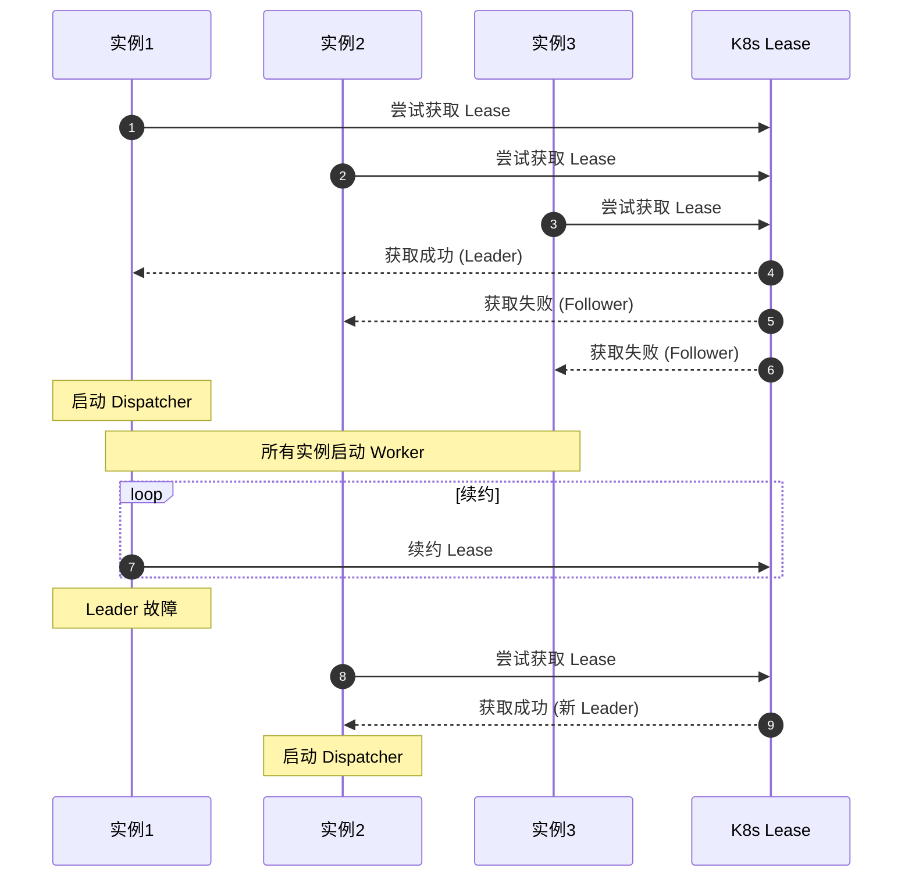

### 角色职责

| 角色 | 职责 | 数量 |
|------|------|------|
| Leader | 运行 Dispatcher 分发任务 | 1 |
| Follower | 只运行 Worker 消费任务 | N-1 |
| Worker | 消费队列、执行工作流 | 所有实例 |

---

## 9. Traits 处理流程

Traits 如何被应用到 Kubernetes 资源：

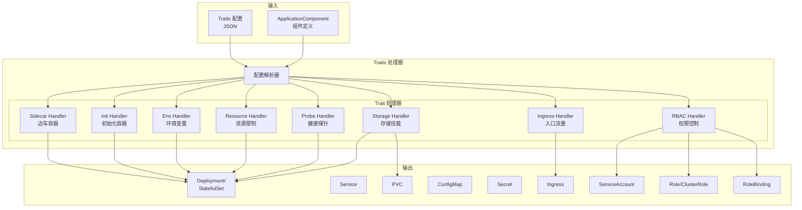

### Traits 处理顺序

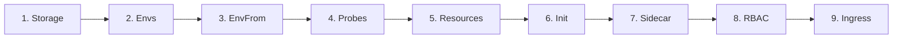

### 嵌套 Traits 支持

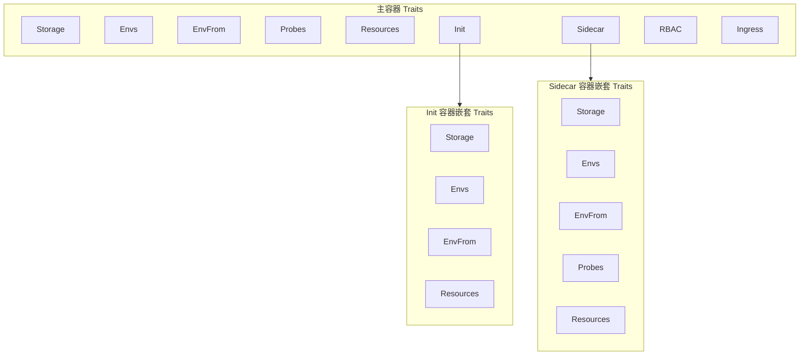

---

## 10. 部署架构

### 单实例部署（开发/测试）

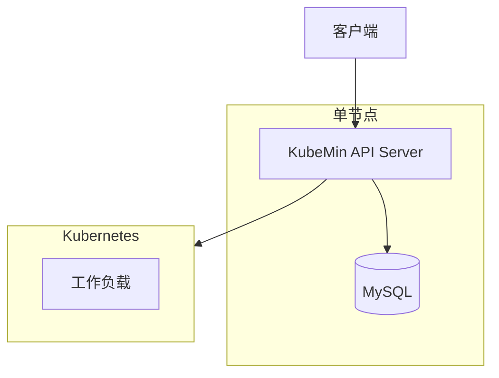

### 多实例部署（生产环境）

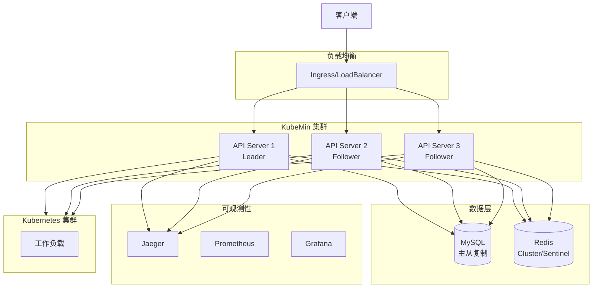

### 部署配置建议

| 环境 | 实例数 | MySQL | Redis | 说明 |
|------|--------|-------|-------|------|
| 开发 | 1 | 单实例 | 可选 | 本地模式，无需 Redis |
| 测试 | 1-3 | 单实例 | 单实例 | 验证分布式功能 |
| 生产 | 3+ (奇数) | 主从/集群 | Sentinel/Cluster | 高可用部署 |

---

## 附录

### A. 目录结构映射

```
KubeMin-Cli/
├── cmd/
│   └── main.go                      # 程序入口
├── pkg/apiserver/
│   ├── server.go                    # API Server 启动
│   ├── config/                      # 配置管理
│   ├── interfaces/api/              # 接口层
│   │   ├── applications.go          # 应用 API
│   │   ├── workflow.go              # 工作流 API
│   │   └── middleware/              # 中间件
│   ├── domain/                      # 领域层
│   │   ├── model/                   # 领域模型
│   │   ├── service/                 # 领域服务
│   │   ├── repository/              # 数据仓储
│   │   └── spec/                    # 规格定义
│   ├── event/workflow/              # 工作流引擎
│   │   ├── workflow.go              # 入口调度
│   │   ├── controller.go            # 任务控制
│   │   ├── dispatcher.go            # 消息分发
│   │   ├── job_builder.go           # Job 构建
│   │   └── job/                     # Job 控制器
│   ├── workflow/                    # 工作流支持
│   │   ├── traits/                  # Traits 处理器
│   │   └── signal/                  # 取消信号
│   ├── infrastructure/              # 基础设施
│   │   ├── datastore/               # 数据存储
│   │   ├── messaging/               # 消息队列
│   │   ├── clients/                 # 外部客户端
│   │   └── observability/           # 可观测性
│   └── utils/                       # 工具函数
└── deploy/                          # 部署配置
```

### B. 技术栈总览

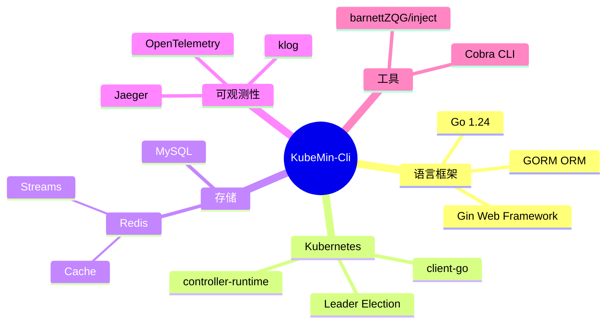

---

*文档版本：1.0.0*
*最后更新：2025-12*


