# KubeMin-Cli 架构图

> 本文档基于代码结构自动生成，包含系统的各层架构图和组件关系图。

## 目录

- [1. 系统整体架构](#1-系统整体架构)
- [2. DDD 分层架构](#2-ddd-分层架构)
- [3. 工作流引擎架构](#3-工作流引擎架构)
- [4. 消息队列架构](#4-消息队列架构)
- [5. OAM 组件与 Traits 关系](#5-oam-组件与-traits-关系)
- [5. Informer 状态同步机制](#5-informer-状态同步机制)
- [6. OAM 组件与 Traits 关系](#6-oam-组件与-traits-关系)
- [7. 项目目录结构](#7-项目目录结构)
- [8. 状态机图](#8-状态机图)

---

## 1. 系统整体架构

### 1.1 高层架构图

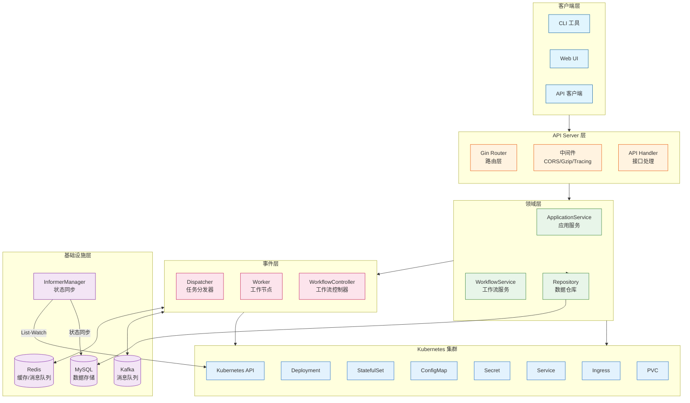

### 1.2 核心组件交互图

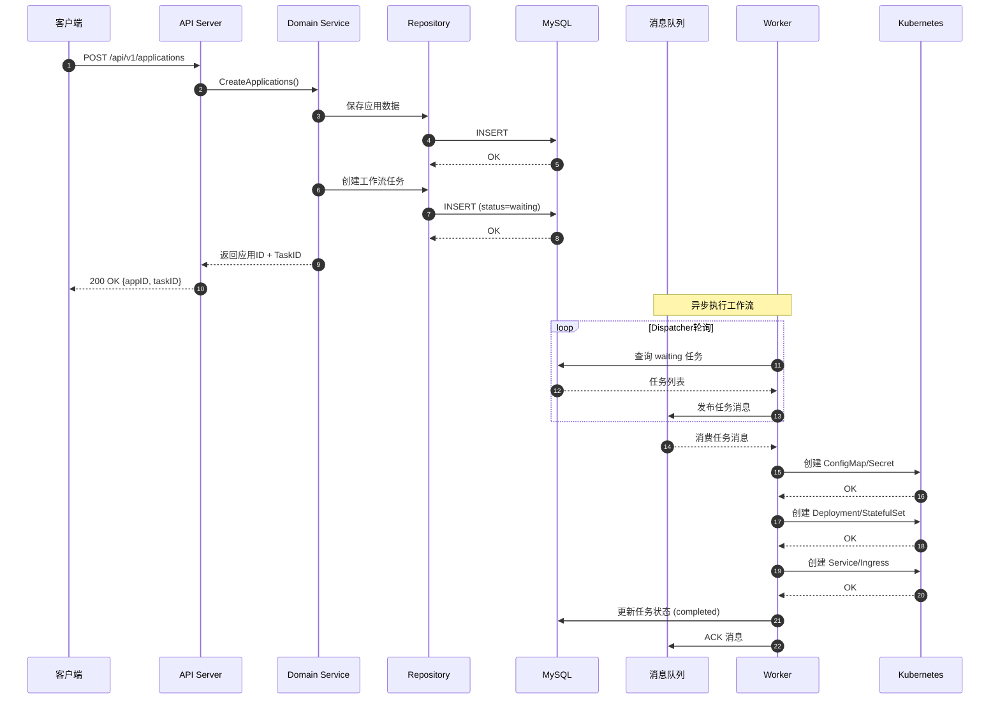

---

## 2. DDD 分层架构

### 2.1 分层架构图

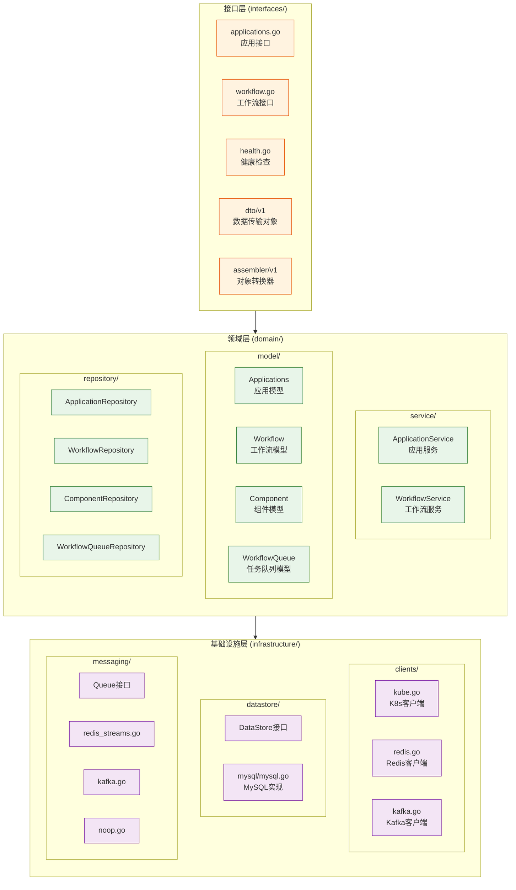

### 2.2 IoC 容器依赖注入图

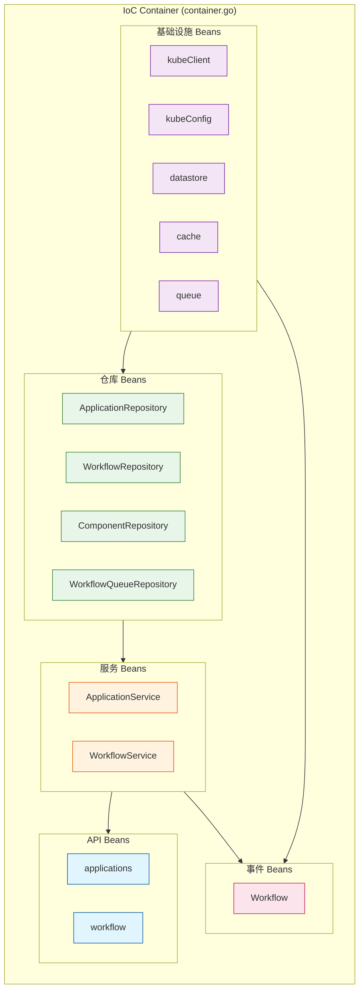

---

## 3. 工作流引擎架构

### 3.1 工作流引擎组件图

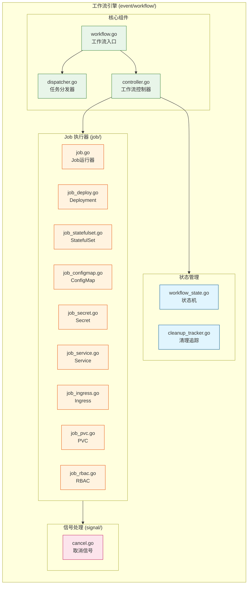

### 3.2 工作流执行流程图

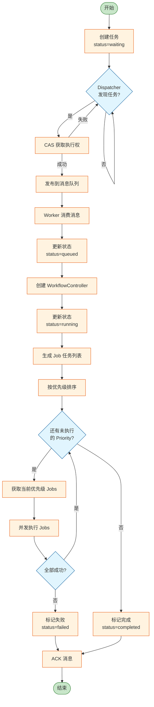

### 3.3 Job 优先级执行图

```mermaid
flowchart LR
    subgraph Priority0["Priority 0 (MaxHigh)"]
        CM[ConfigMap]
        Secret[Secret]
    end
    
    subgraph Priority1["Priority 1 (High)"]
        PVC[PVC]
        SA[ServiceAccount]
        Role[Role/ClusterRole]
        RB[RoleBinding]
    end
    
    subgraph Priority10["Priority 10 (Normal)"]
        Deploy[Deployment]
        STS[StatefulSet]
        SVC[Service]
    end
    
    subgraph Priority20["Priority 20 (Low)"]
        Ingress[Ingress]
        Cleanup[Cleanup Tasks]
    end

    Priority0 -->|完成后| Priority1
    Priority1 -->|完成后| Priority10
    Priority10 -->|完成后| Priority20

    classDef p0 fill:#ffcdd2,stroke:#c62828
    classDef p1 fill:#fff9c4,stroke:#f9a825
    classDef p10 fill:#c8e6c9,stroke:#2e7d32
    classDef p20 fill:#e1f5fe,stroke:#01579b

    class CM,Secret p0
    class PVC,SA,Role,RB p1
    class Deploy,STS,SVC p10
    class Ingress,Cleanup p20
```

---

## 4. 消息队列架构

### 4.1 消息队列抽象层

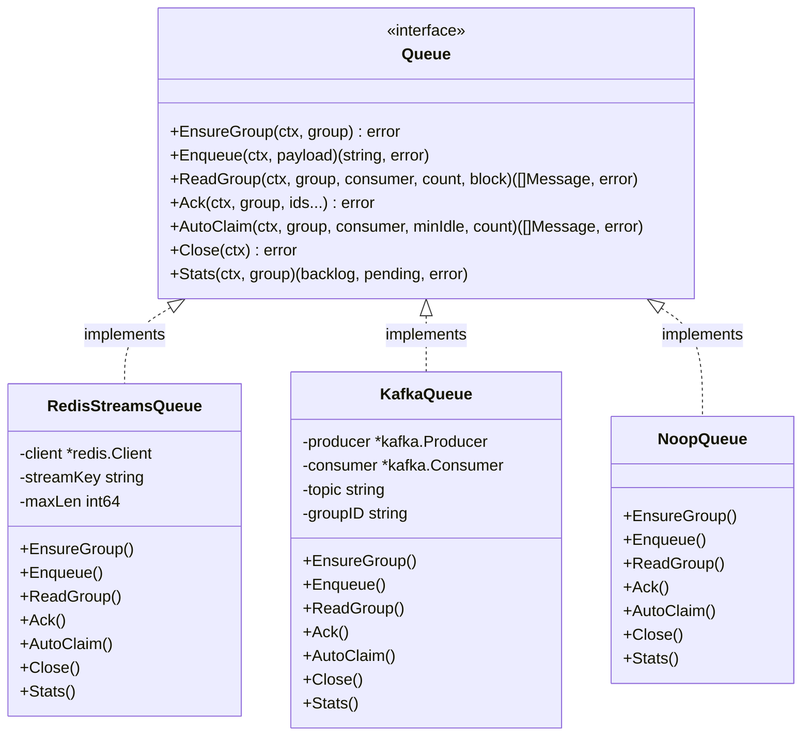

### 4.2 分布式模式架构图 (Redis Streams)

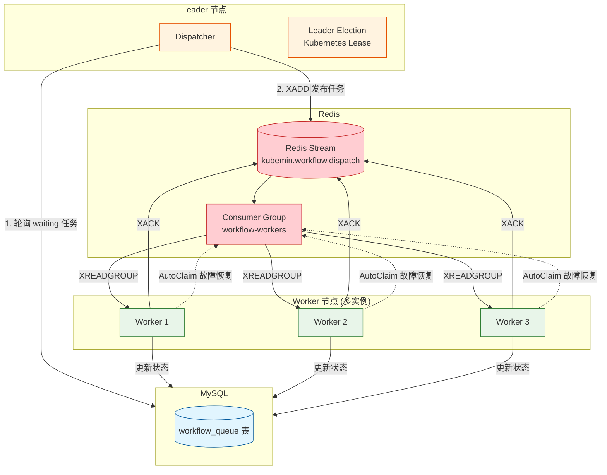

### 4.3 分布式模式架构图 (Kafka)

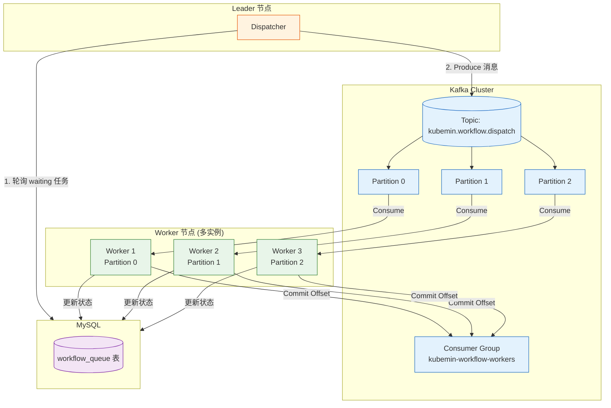

### 4.4 本地模式 vs 分布式模式

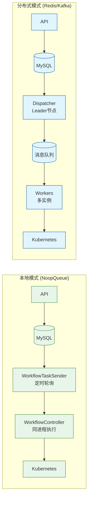

---

## 5. Informer 状态同步机制

### 5.1 概述

Informer 状态同步机制用于实时监听 Kubernetes 资源变化，并将组件运行状态同步到数据库。相比传统轮询方式，Informer 采用 List-Watch 机制，具有以下优势：

- **实时性**：事件驱动，状态变更即时感知
- **高效性**：减少 API Server 请求，降低集群负载
- **可靠性**：本地缓存 + 增量更新，网络抖动自动恢复

### 5.2 架构图

```mermaid
flowchart TB
    subgraph K8s["Kubernetes 集群"]
        APIServer[API Server]
        Deploy[Deployment]
        STS[StatefulSet]
    end

    subgraph InformerLayer["Informer 层 (infrastructure/informer/)"]
        direction TB
        Manager[InformerManager<br/>管理器]
        Factory[SharedInformerFactory<br/>工厂]
        DeployInformer[Deployment Informer]
        STSInformer[StatefulSet Informer]
        Waiter[ResourceReadyWaiter<br/>资源等待器]
    end

    subgraph StatusSync["状态同步"]
        SyncFunc[syncComponentStatus<br/>同步回调]
        DB[(MySQL<br/>min_app_components)]
    end

    subgraph JobLayer["Job 执行层"]
        DeployJob[DeployJobCtl]
        STSJob[StatefulSetJobCtl]
        WaitFunc[wait() 函数]
    end

    APIServer -->|List-Watch| Factory
    Factory --> DeployInformer
    Factory --> STSInformer
    
    DeployInformer -->|Add/Update/Delete 事件| Waiter
    STSInformer -->|Add/Update/Delete 事件| Waiter
    
    Waiter -->|状态变更| SyncFunc
    SyncFunc -->|UPDATE status, ready_replicas| DB
    
    Waiter -->|通知就绪| WaitFunc
    WaitFunc --> DeployJob
    WaitFunc --> STSJob

    classDef k8s fill:#e3f2fd,stroke:#1565c0
    classDef informer fill:#e8f5e9,stroke:#2e7d32
    classDef sync fill:#fff3e0,stroke:#e65100
    classDef job fill:#fce4ec,stroke:#c2185b

    class APIServer,Deploy,STS k8s
    class Manager,Factory,DeployInformer,STSInformer,Waiter informer
    class SyncFunc,DB sync
    class DeployJob,STSJob,WaitFunc job
```

### 5.3 核心组件

| 组件 | 文件 | 职责 |
|------|------|------|
| `Manager` | `infrastructure/informer/manager.go` | 管理 Informer 生命周期，注册事件处理器 |
| `ResourceReadyWaiter` | `infrastructure/informer/waiter.go` | 处理资源事件，通知等待者，同步状态到数据库 |
| `types.go` | `infrastructure/informer/types.go` | 定义状态类型、等待条目、状态更新结构 |

### 5.4 状态同步流程

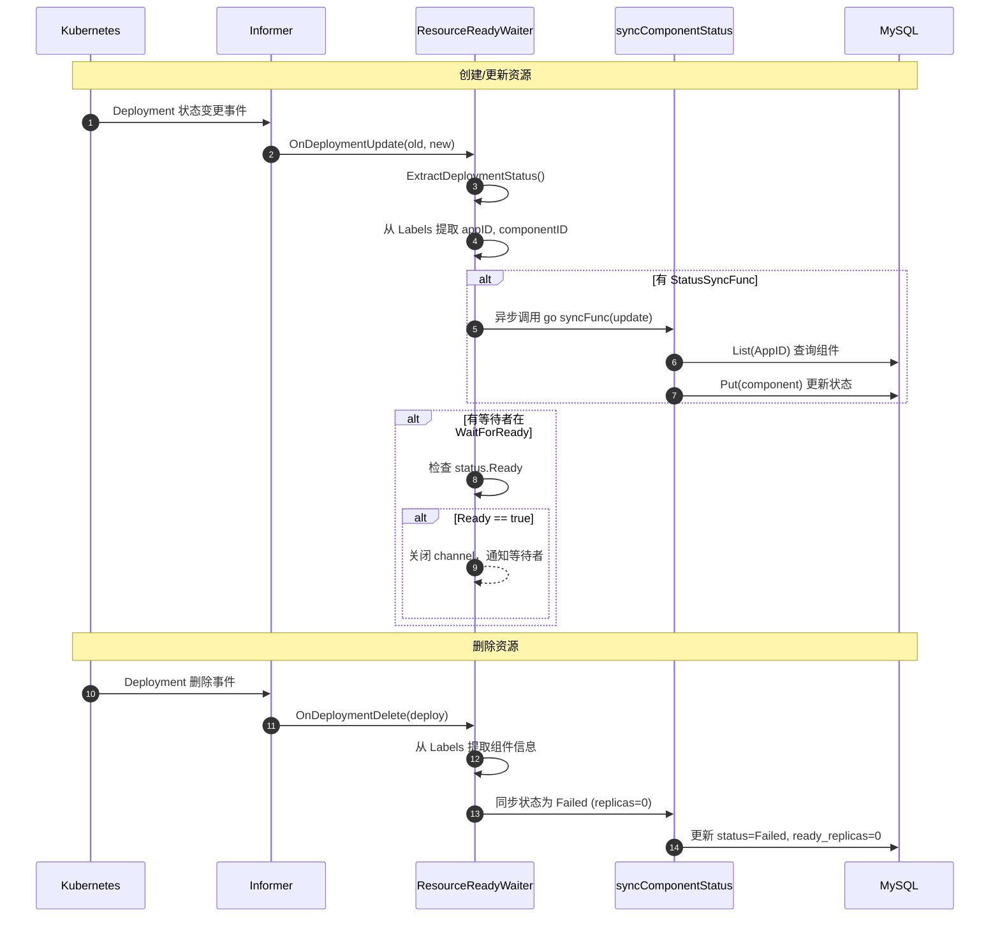

### 5.5 Label 约定

Informer 依赖以下 Labels 来识别和过滤资源：

| Label Key | 说明 | 示例值 |
|-----------|------|--------|
| `kube-min-cli-appId` | 应用 ID | `1us2dy3a2yhczm8yes6spm88` |
| `kube-min-cli-componentId` | 组件 ID | `1` |
| `kube-min-cli-componentName` | 组件名称 | `nginx` |

**重要**：Labels 必须同时设置在资源的 `metadata.labels` 和 `spec.template.metadata.labels` 上：

```go
deployment := &appsv1.Deployment{
    ObjectMeta: metav1.ObjectMeta{
        Name:      deploymentName,
        Namespace: component.Namespace,
        Labels:    labels,  // ← Informer 过滤和状态同步依赖此
    },
    Spec: appsv1.DeploymentSpec{
        Selector: &metav1.LabelSelector{
            MatchLabels: labels,
        },
        Template: corev1.PodTemplateSpec{
            ObjectMeta: metav1.ObjectMeta{
                Labels: labels,  // ← Pod 选择器依赖此
            },
            // ...
        },
    },
}
```

### 5.6 组件状态枚举

```go
// config/consts.go
type ComponentStatus string

const (
    ComponentStatusRunning ComponentStatus = "Running"  // 所有副本就绪
    ComponentStatusPending ComponentStatus = "Pending"  // 部分副本就绪或启动中
    ComponentStatusFailed  ComponentStatus = "Failed"   // 失败或已删除
    ComponentStatusUnknown ComponentStatus = "Unknown"  // 未知状态
)
```

**状态计算逻辑**：

| 条件 | 状态 |
|------|------|
| `ready == true` (ReadyReplicas == Replicas) | Running |
| `readyReplicas > 0` | Pending |
| `replicas > 0 && readyReplicas == 0` | Pending |
| `replicas == 0` (资源被删除或缩容为 0) | Failed |

### 5.7 数据库字段

`min_app_components` 表新增字段：

| 字段 | 类型 | 说明 |
|------|------|------|
| `status` | VARCHAR(32) | 运行状态 (Running/Pending/Failed/Unknown) |
| `ready_replicas` | INT | 就绪副本数 |

**DDL**：

```sql
ALTER TABLE min_app_components 
ADD COLUMN status VARCHAR(32) DEFAULT 'Unknown' COMMENT '运行状态',
ADD COLUMN ready_replicas INT DEFAULT 0 COMMENT '就绪副本数';
```

### 5.8 LabelSelector 过滤优化

为减少内存消耗，Informer 仅监听带有 `kube-min-cli-appId` 标签的资源：

```go
// server.go
s.InformerManager = informer.NewManager(
    kubeClient,
    informer.WithResyncPeriod(30*time.Second),
    informer.WithLabelSelector(config.LabelAppID),  // 只监听 KubeMin 管理的资源
)
```

这样 Informer 不会缓存集群中其他应用的 Deployment/StatefulSet，显著降低内存占用。

### 5.9 事件驱动 vs 轮询对比

| 特性 | 事件驱动 (Informer) | 轮询 (Polling) |
|------|---------------------|----------------|
| 实时性 | 毫秒级 | 取决于轮询间隔 |
| API 调用 | 初始 List + 增量 Watch | 每次轮询都调用 |
| 资源消耗 | 低 (本地缓存) | 高 (频繁请求) |
| 适用场景 | 状态同步、等待就绪 | 简单查询、兜底方案 |

当前实现中，`wait()` 函数优先使用 Informer 事件驱动，当 Informer 不可用时自动降级为轮询：

```go
func (c *DeployJobCtl) wait(ctx context.Context) error {
    waiter := GetGlobalWaiter()
    if waiter != nil {
        // 优先使用 Informer 事件驱动
        return waiter.WaitForDeploymentReady(ctx, namespace, name, timeout)
    }
    // 降级为轮询
    return c.waitPolling(ctx)
}
```

---

## 6. OAM 组件与 Traits 关系

### 6.1 OAM 模型结构

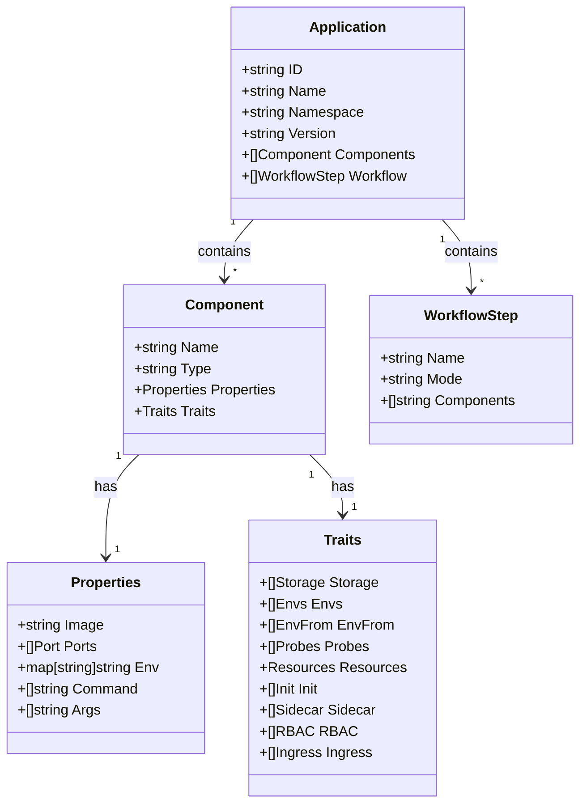

### 6.2 Traits 处理流程图

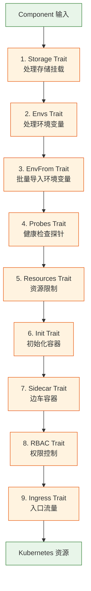

### 6.3 组件类型与生成资源

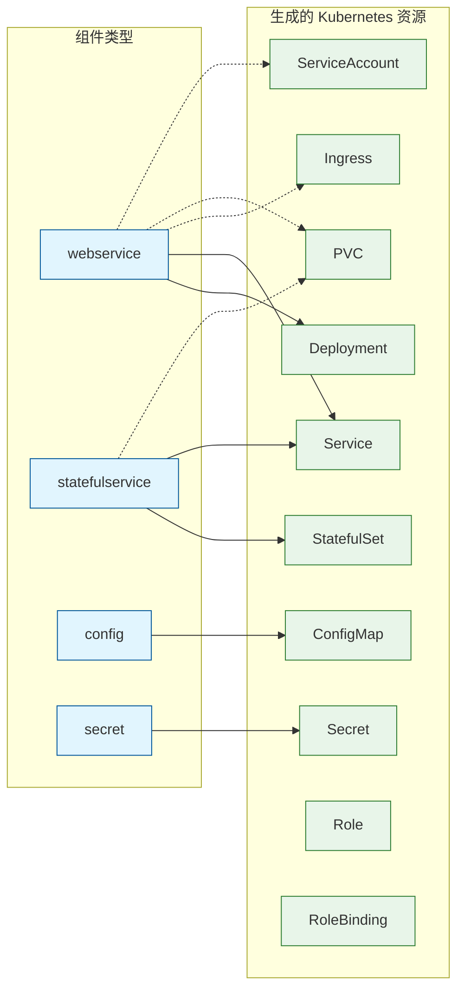

---

## 7. 项目目录结构

```
KubeMin-Cli/
├── cmd/                              # 入口点
│   ├── main.go                       # 主程序入口
│   └── server/
│       └── app/
│           ├── options/              # 命令行参数
│           └── server.go             # 服务器启动
│
├── pkg/apiserver/                    # 核心 API 服务器
│   ├── server.go                     # 服务器实现
│   ├── config/                       # 配置管理
│   │
│   ├── interfaces/                   # 接口层 (DDD)
│   │   └── api/
│   │       ├── applications.go       # 应用接口
│   │       ├── workflow.go           # 工作流接口
│   │       ├── health.go             # 健康检查
│   │       ├── dto/v1/               # 数据传输对象
│   │       ├── assembler/v1/         # 对象转换器
│   │       └── middleware/           # 中间件
│   │
│   ├── domain/                       # 领域层 (DDD)
│   │   ├── model/                    # 领域模型
│   │   │   ├── applications.go
│   │   │   ├── workflow.go
│   │   │   └── ...
│   │   ├── repository/               # 仓库接口
│   │   │   ├── application.go
│   │   │   ├── workflow.go
│   │   │   └── ...
│   │   └── service/                  # 领域服务
│   │       ├── application.go
│   │       └── workflow.go
│   │
│   ├── infrastructure/               # 基础设施层 (DDD)
│   │   ├── clients/                  # 外部客户端
│   │   │   ├── kube.go               # Kubernetes 客户端
│   │   │   ├── redis.go              # Redis 客户端
│   │   │   └── kafka.go              # Kafka 客户端
│   │   ├── datastore/                # 数据存储
│   │   │   └── mysql/                # MySQL 实现
│   │   └── messaging/                # 消息队列
│   │       ├── queue.go              # 队列接口
│   │       ├── redis_streams.go      # Redis Streams 实现
│   │       ├── kafka.go              # Kafka 实现
│   │       └── noop.go               # 空实现 (本地模式)
│   │
│   ├── event/                        # 事件层
│   │   ├── event.go                  # 事件入口
│   │   └── workflow/                 # 工作流引擎
│   │       ├── workflow.go           # 工作流入口
│   │       ├── controller.go         # 工作流控制器
│   │       ├── dispatcher.go         # 任务分发器
│   │       └── job/                  # Job 执行器
│   │           ├── job.go
│   │           ├── job_deploy.go
│   │           ├── job_statefulset.go
│   │           ├── job_configmap.go
│   │           └── ...
│   │
│   ├── workflow/                     # 工作流支持
│   │   ├── traits/                   # Traits 处理器
│   │   │   ├── storage.go
│   │   │   ├── env.go
│   │   │   ├── probe.go
│   │   │   ├── resources.go
│   │   │   ├── sidecar.go
│   │   │   ├── rbac.go
│   │   │   └── ingress.go
│   │   ├── naming/                   # 命名规则
│   │   └── signal/                   # 信号处理
│   │
│   └── utils/                        # 工具类
│       ├── cache/                    # 缓存实现
│       ├── container/                # IoC 容器
│       ├── template/                 # 模板引擎
│       └── bcode/                    # 错误码
│
├── deploy/                           # 部署配置
│   ├── helm/                         # Helm Charts
│   └── mysql/                        # MySQL 初始化
│
├── docs/                             # 文档
├── examples/                         # 示例
└── scripts/                          # 脚本
```

---

## 8. 状态机图

### 8.1 工作流任务状态机

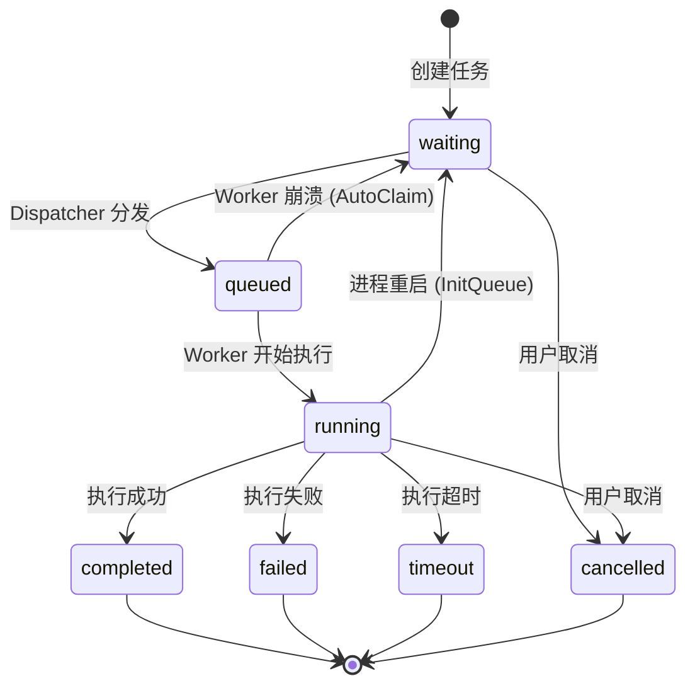

### 8.2 Leader 选举状态机

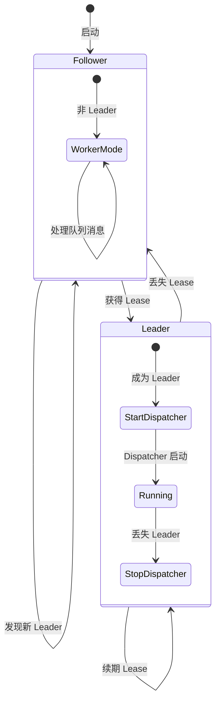

---

## 附录：技术栈

| 层次 | 技术选型 |
|------|----------|
| Web 框架 | Gin |
| 数据库 | MySQL |
| 缓存 | Redis |
| 消息队列 | Redis Streams / Kafka |
| 容器编排 | Kubernetes |
| 配置管理 | Viper |
| 日志 | klog |
| 链路追踪 | OpenTelemetry |
| 依赖注入 | 自研 IoC 容器 |
| API 风格 | RESTful |

---

*文档生成时间：2024-12*  
*最后更新：2024-12（新增 Informer 状态同步机制章节）*

