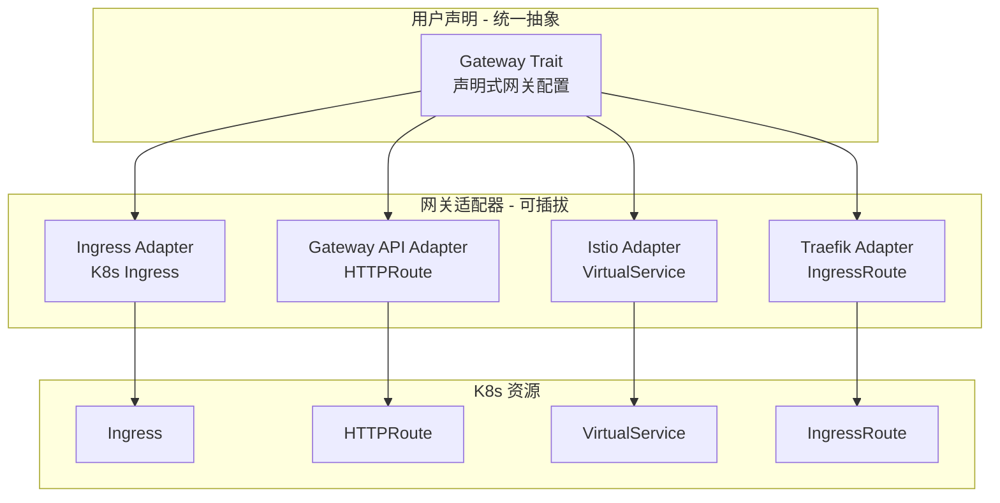
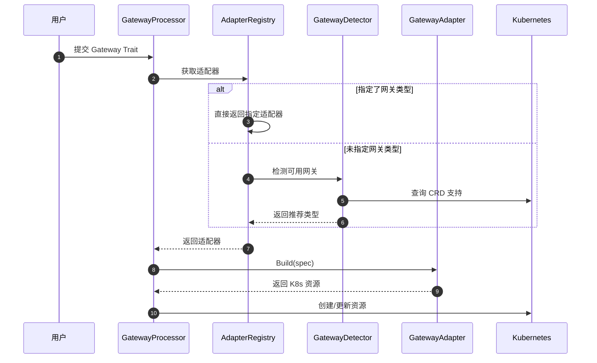
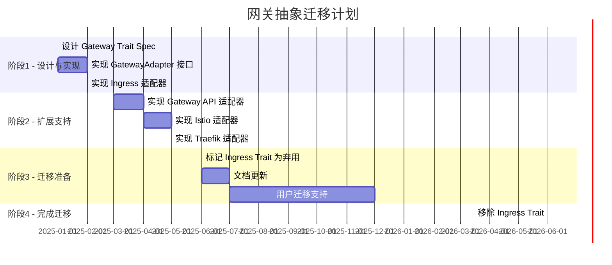
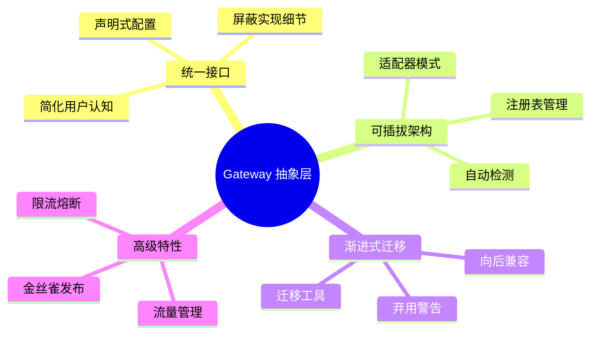

# Gateway 抽象层设计草案

> **状态**: 草案 (Draft)  
> **版本**: 0.1.0  
> **创建日期**: 2025-12  
> **背景**: Kubernetes Ingress 将于 2026 年 6 月停止维护，需要设计抽象层以支持平滑迁移

## 目录

- [1. 背景与动机](#1-背景与动机)
- [2. 设计目标](#2-设计目标)
- [3. 架构设计](#3-架构设计)
- [4. 抽象 Spec 定义](#4-抽象-spec-定义)
- [5. 适配器接口设计](#5-适配器接口设计)
- [6. 适配器实现](#6-适配器实现)
- [7. Traits 结构更新](#7-traits-结构更新)
- [8. 用户使用示例](#8-用户使用示例)
- [9. 迁移策略](#9-迁移策略)
- [10. 优势总结](#10-优势总结)

---

## 1. 背景与动机

### 1.1 问题陈述

当前项目使用 Kubernetes Ingress 作为网关入口，存在以下问题：

1. **Ingress 停止维护**: Kubernetes 官方宣布 Ingress 将于 2026 年 6 月停止维护
2. **功能局限**: Ingress 功能相对有限，不支持高级流量管理（如限流、重试、熔断）
3. **供应商锁定**: 直接依赖 Ingress 导致切换网关组件成本高
4. **配置碎片化**: 不同网关控制器使用不同的 Annotations，缺乏统一标准

### 1.2 网关生态现状

| 网关方案 | 状态 | 特点 |
|----------|------|------|
| Kubernetes Ingress | 即将废弃 | 简单、广泛支持、功能有限 |
| Gateway API | 官方推荐 | 新标准、功能丰富、表达力强 |
| Istio VirtualService | 生产可用 | 服务网格、高级流量管理 |
| Traefik IngressRoute | 生产可用 | 云原生、自动发现 |
| APISIX/Kong | 生产可用 | API 网关、插件丰富 |

### 1.3 解决方案

设计一个抽象的 **Gateway Trait**，屏蔽底层网关实现细节：

- 用户只需声明"对外暴露服务"的意图
- 底层通过适配器模式支持多种网关实现
- 可根据集群环境自动选择最佳网关类型

---

## 2. 设计目标

### 2.1 核心目标

1. **抽象统一**: 提供统一的网关配置接口，屏蔽底层差异
2. **可扩展性**: 通过适配器模式轻松支持新的网关类型
3. **向后兼容**: 保留现有 Ingress trait，支持渐进式迁移
4. **自动适配**: 可根据集群安装的组件自动选择网关
5. **功能丰富**: 支持高级流量管理特性（限流、重试、超时等）

### 2.2 非目标

- 不直接管理网关控制器的部署
- 不处理证书自动签发（由 cert-manager 等外部组件处理）
- 不实现服务网格的完整功能

---

## 3. 架构设计

### 3.1 整体架构



### 3.2 组件职责

| 组件 | 职责 |
|------|------|
| GatewayTraitSpec | 定义统一的网关配置模型 |
| GatewayAdapter | 适配器接口，定义网关转换契约 |
| AdapterRegistry | 管理和选择适配器 |
| GatewayDetector | 检测集群支持的网关类型 |
| GatewayProcessor | Trait 处理器入口 |

### 3.3 处理流程



---

## 4. 抽象 Spec 定义

### 4.1 文件位置

`pkg/apiserver/domain/spec/gateway.go`

### 4.2 类型定义

```go
package spec

// GatewayType 定义网关实现类型
type GatewayType string

const (
    GatewayTypeIngress    GatewayType = "ingress"     // Kubernetes Ingress (默认)
    GatewayTypeGatewayAPI GatewayType = "gateway-api" // K8s Gateway API (HTTPRoute)
    GatewayTypeIstio      GatewayType = "istio"       // Istio VirtualService
    GatewayTypeTraefik    GatewayType = "traefik"     // Traefik IngressRoute
)

// GatewayTraitSpec 定义统一的网关配置
// 用户只需要声明"对外暴露服务"的意图，底层实现由适配器处理
type GatewayTraitSpec struct {
    // Name 网关资源名称（可选，默认自动生成）
    Name string `json:"name,omitempty"`
    
    // Type 网关类型，可选值：ingress, gateway-api, istio, traefik
    // 默认值通过全局配置或集群检测确定
    Type GatewayType `json:"type,omitempty"`
    
    // Hosts 域名列表
    Hosts []string `json:"hosts,omitempty"`
    
    // Routes 路由规则
    Routes []GatewayRoute `json:"routes"`
    
    // TLS 配置
    TLS *GatewayTLS `json:"tls,omitempty"`
    
    // TrafficPolicy 流量策略（高级功能）
    TrafficPolicy *TrafficPolicy `json:"trafficPolicy,omitempty"`
    
    // Labels 标签
    Labels map[string]string `json:"labels,omitempty"`
    
    // Annotations 注解（用于传递特定网关的配置）
    Annotations map[string]string `json:"annotations,omitempty"`
    
    // ProviderConfig 特定网关提供商的额外配置
    ProviderConfig map[string]interface{} `json:"providerConfig,omitempty"`
}

// GatewayRoute 统一的路由规则
type GatewayRoute struct {
    // Path 匹配路径
    Path string `json:"path,omitempty"`
    
    // PathType 路径匹配类型: prefix, exact, regex
    PathType string `json:"path_type,omitempty"`
    
    // Host 路由级别的主机名（覆盖全局 Hosts）
    Host string `json:"host,omitempty"`
    
    // Methods HTTP 方法过滤（可选）
    Methods []string `json:"methods,omitempty"`
    
    // Headers 请求头匹配（可选）
    Headers map[string]string `json:"headers,omitempty"`
    
    // Backend 后端服务
    Backend GatewayBackend `json:"backend"`
    
    // Rewrite 路径重写
    Rewrite *GatewayRewrite `json:"rewrite,omitempty"`
    
    // RateLimit 限流（高级功能）
    RateLimit *RateLimitPolicy `json:"rateLimit,omitempty"`
    
    // Timeout 超时配置
    Timeout *TimeoutPolicy `json:"timeout,omitempty"`
    
    // Retry 重试配置
    Retry *RetryPolicy `json:"retry,omitempty"`
}

// GatewayBackend 后端服务定义
type GatewayBackend struct {
    // ServiceName 服务名称
    ServiceName string `json:"service_name"`
    
    // ServicePort 服务端口
    ServicePort int32 `json:"service_port,omitempty"`
    
    // Weight 权重（用于流量分割）
    Weight int32 `json:"weight,omitempty"`
}

// GatewayTLS TLS 配置
type GatewayTLS struct {
    // Mode TLS 模式: terminate, passthrough, mutual
    Mode string `json:"mode,omitempty"`
    
    // SecretName 证书 Secret 名称
    SecretName string `json:"secret_name,omitempty"`
    
    // Hosts 适用的域名
    Hosts []string `json:"hosts,omitempty"`
}

// GatewayRewrite 路径重写
type GatewayRewrite struct {
    // Type 重写类型: replace, prefix, regex
    Type string `json:"type,omitempty"`
    
    // Match 匹配模式（regex 类型使用）
    Match string `json:"match,omitempty"`
    
    // Replacement 替换值
    Replacement string `json:"replacement,omitempty"`
}

// TrafficPolicy 流量策略
type TrafficPolicy struct {
    // LoadBalancer 负载均衡策略: round-robin, least-connections, random
    LoadBalancer string `json:"loadBalancer,omitempty"`
    
    // ConnectionPool 连接池配置
    ConnectionPool *ConnectionPoolSettings `json:"connectionPool,omitempty"`
}

// TimeoutPolicy 超时策略
type TimeoutPolicy struct {
    // Request 请求超时
    Request string `json:"request,omitempty"`
    
    // Backend 后端超时
    Backend string `json:"backend,omitempty"`
}

// RetryPolicy 重试策略
type RetryPolicy struct {
    // Attempts 重试次数
    Attempts int32 `json:"attempts,omitempty"`
    
    // PerTryTimeout 每次重试超时
    PerTryTimeout string `json:"perTryTimeout,omitempty"`
    
    // RetryOn 触发重试的条件
    RetryOn []string `json:"retryOn,omitempty"`
}

// RateLimitPolicy 限流策略
type RateLimitPolicy struct {
    // RequestsPerSecond 每秒请求数
    RequestsPerSecond int32 `json:"requestsPerSecond,omitempty"`
    
    // BurstSize 突发大小
    BurstSize int32 `json:"burstSize,omitempty"`
}

// ConnectionPoolSettings 连接池设置
type ConnectionPoolSettings struct {
    MaxConnections     int32  `json:"maxConnections,omitempty"`
    ConnectTimeout     string `json:"connectTimeout,omitempty"`
    MaxRequestsPerConn int32  `json:"maxRequestsPerConn,omitempty"`
}
```

---

## 5. 适配器接口设计

### 5.1 文件位置

`pkg/apiserver/workflow/traits/gateway/adapter.go`

### 5.2 接口定义

```go
package gateway

import (
    "context"
    "sigs.k8s.io/controller-runtime/pkg/client"
    
    spec "kubemin-cli/pkg/apiserver/domain/spec"
)

// GatewayAdapter 网关适配器接口
type GatewayAdapter interface {
    // Name 适配器名称
    Name() string
    
    // Type 支持的网关类型
    Type() spec.GatewayType
    
    // Build 根据 GatewayTraitSpec 构建 K8s 资源
    Build(ctx context.Context, spec *spec.GatewayTraitSpec, namespace string) ([]client.Object, error)
    
    // Validate 验证配置是否有效
    Validate(spec *spec.GatewayTraitSpec) error
    
    // IsAvailable 检测集群是否支持该网关类型
    IsAvailable(ctx context.Context) bool
}

// AdapterRegistry 适配器注册表
type AdapterRegistry struct {
    adapters map[spec.GatewayType]GatewayAdapter
    detector GatewayDetector
}

// GatewayDetector 网关检测器
type GatewayDetector interface {
    // Detect 检测集群支持的网关类型
    Detect(ctx context.Context) []spec.GatewayType
    
    // PreferredType 返回推荐的网关类型
    PreferredType(ctx context.Context) spec.GatewayType
}

// NewAdapterRegistry 创建适配器注册表
func NewAdapterRegistry() *AdapterRegistry {
    r := &AdapterRegistry{
        adapters: make(map[spec.GatewayType]GatewayAdapter),
    }
    
    // 注册默认适配器
    r.Register(&IngressAdapter{})
    r.Register(&GatewayAPIAdapter{})
    r.Register(&IstioAdapter{})
    r.Register(&TraefikAdapter{})
    
    return r
}

func (r *AdapterRegistry) Register(adapter GatewayAdapter) {
    r.adapters[adapter.Type()] = adapter
}

func (r *AdapterRegistry) Get(gatewayType spec.GatewayType) (GatewayAdapter, bool) {
    adapter, ok := r.adapters[gatewayType]
    return adapter, ok
}

func (r *AdapterRegistry) ResolveAdapter(ctx context.Context, requested spec.GatewayType) GatewayAdapter {
    // 如果指定了类型，直接返回
    if requested != "" {
        if adapter, ok := r.adapters[requested]; ok {
            return adapter
        }
    }
    
    // 否则使用检测器确定
    if r.detector != nil {
        preferred := r.detector.PreferredType(ctx)
        if adapter, ok := r.adapters[preferred]; ok {
            return adapter
        }
    }
    
    // 默认回退到 Ingress
    return r.adapters[spec.GatewayTypeIngress]
}
```

---

## 6. 适配器实现

### 6.1 Ingress 适配器

**文件**: `pkg/apiserver/workflow/traits/gateway/ingress_adapter.go`

```go
package gateway

import (
    "context"
    "fmt"
    
    networkingv1 "k8s.io/api/networking/v1"
    metav1 "k8s.io/apimachinery/pkg/apis/meta/v1"
    "sigs.k8s.io/controller-runtime/pkg/client"
    
    spec "kubemin-cli/pkg/apiserver/domain/spec"
)

type IngressAdapter struct{}

func (a *IngressAdapter) Name() string {
    return "kubernetes-ingress"
}

func (a *IngressAdapter) Type() spec.GatewayType {
    return spec.GatewayTypeIngress
}

func (a *IngressAdapter) Build(ctx context.Context, gwSpec *spec.GatewayTraitSpec, namespace string) ([]client.Object, error) {
    ing := &networkingv1.Ingress{
        ObjectMeta: metav1.ObjectMeta{
            Name:        gwSpec.Name,
            Namespace:   namespace,
            Labels:      gwSpec.Labels,
            Annotations: gwSpec.Annotations,
        },
        Spec: networkingv1.IngressSpec{},
    }
    
    // 转换 TLS 配置
    if gwSpec.TLS != nil {
        ing.Spec.TLS = []networkingv1.IngressTLS{{
            Hosts:      gwSpec.TLS.Hosts,
            SecretName: gwSpec.TLS.SecretName,
        }}
    }
    
    // 转换路由规则
    hostRules := make(map[string][]networkingv1.HTTPIngressPath)
    for _, route := range gwSpec.Routes {
        host := route.Host
        if host == "" && len(gwSpec.Hosts) > 0 {
            host = gwSpec.Hosts[0]
        }
        
        path_type := a.convertPathType(route.PathType)
        path := networkingv1.HTTPIngressPath{
            Path:     route.Path,
            PathType: &path_type,
            Backend: networkingv1.IngressBackend{
                Service: &networkingv1.IngressServiceBackend{
                    Name: route.Backend.ServiceName,
                    Port: networkingv1.ServiceBackendPort{
                        Number: route.Backend.ServicePort,
                    },
                },
            },
        }
        hostRules[host] = append(hostRules[host], path)
    }
    
    for host, paths := range hostRules {
        rule := networkingv1.IngressRule{
            Host: host,
            IngressRuleValue: networkingv1.IngressRuleValue{
                HTTP: &networkingv1.HTTPIngressRuleValue{
                    Paths: paths,
                },
            },
        }
        ing.Spec.Rules = append(ing.Spec.Rules, rule)
    }
    
    ing.SetGroupVersionKind(networkingv1.SchemeGroupVersion.WithKind("Ingress"))
    return []client.Object{ing}, nil
}

func (a *IngressAdapter) convertPathType(pt string) networkingv1.PathType {
    switch pt {
    case "exact":
        return networkingv1.PathTypeExact
    case "regex":
        return networkingv1.PathTypeImplementationSpecific
    default:
        return networkingv1.PathTypePrefix
    }
}

func (a *IngressAdapter) Validate(spec *spec.GatewayTraitSpec) error {
    if len(spec.Routes) == 0 {
        return fmt.Errorf("at least one route is required")
    }
    return nil
}

func (a *IngressAdapter) IsAvailable(ctx context.Context) bool {
    // Ingress 始终可用（K8s 内置）
    return true
}
```

### 6.2 Gateway API 适配器

**文件**: `pkg/apiserver/workflow/traits/gateway/gatewayapi_adapter.go`

```go
package gateway

import (
    "context"
    "fmt"
    
    metav1 "k8s.io/apimachinery/pkg/apis/meta/v1"
    "sigs.k8s.io/controller-runtime/pkg/client"
    gatewayv1 "sigs.k8s.io/gateway-api/apis/v1"
    
    spec "kubemin-cli/pkg/apiserver/domain/spec"
)

type GatewayAPIAdapter struct{}

func (a *GatewayAPIAdapter) Name() string {
    return "kubernetes-gateway-api"
}

func (a *GatewayAPIAdapter) Type() spec.GatewayType {
    return spec.GatewayTypeGatewayAPI
}

func (a *GatewayAPIAdapter) Build(ctx context.Context, gwSpec *spec.GatewayTraitSpec, namespace string) ([]client.Object, error) {
    httpRoute := &gatewayv1.HTTPRoute{
        ObjectMeta: metav1.ObjectMeta{
            Name:        gwSpec.Name,
            Namespace:   namespace,
            Labels:      gwSpec.Labels,
            Annotations: gwSpec.Annotations,
        },
        Spec: gatewayv1.HTTPRouteSpec{},
    }
    
    // 设置父网关引用（从 ProviderConfig 获取或使用默认值）
    gatewayName := "default-gateway"
    if gwSpec.ProviderConfig != nil {
        if gw, ok := gwSpec.ProviderConfig["gatewayName"].(string); ok {
            gatewayName = gw
        }
    }
    httpRoute.Spec.ParentRefs = []gatewayv1.ParentReference{{
        Name: gatewayv1.ObjectName(gatewayName),
    }}
    
    // 设置 Hostnames
    for _, host := range gwSpec.Hosts {
        httpRoute.Spec.Hostnames = append(httpRoute.Spec.Hostnames, gatewayv1.Hostname(host))
    }
    
    // 转换路由规则
    for _, route := range gwSpec.Routes {
        rule := gatewayv1.HTTPRouteRule{}
        
        // 匹配条件
        match := gatewayv1.HTTPRouteMatch{}
        if route.Path != "" {
            path_type := a.convertPathType(route.PathType)
            match.Path = &gatewayv1.HTTPPathMatch{
                Type:  &path_type,
                Value: &route.Path,
            }
        }
        
        // HTTP 方法匹配
        if len(route.Methods) > 0 {
            method := gatewayv1.HTTPMethod(route.Methods[0])
            match.Method = &method
        }
        
        rule.Matches = []gatewayv1.HTTPRouteMatch{match}
        
        // 后端服务
        port := gatewayv1.PortNumber(route.Backend.ServicePort)
        rule.BackendRefs = []gatewayv1.HTTPBackendRef{{
            BackendRef: gatewayv1.BackendRef{
                BackendObjectReference: gatewayv1.BackendObjectReference{
                    Name: gatewayv1.ObjectName(route.Backend.ServiceName),
                    Port: &port,
                },
            },
        }}
        
        // 路径重写
        if route.Rewrite != nil {
            rule.Filters = append(rule.Filters, gatewayv1.HTTPRouteFilter{
                Type: gatewayv1.HTTPRouteFilterURLRewrite,
                URLRewrite: &gatewayv1.HTTPURLRewriteFilter{
                    Path: &gatewayv1.HTTPPathModifier{
                        Type:               gatewayv1.PrefixMatchHTTPPathModifier,
                        ReplacePrefixMatch: &route.Rewrite.Replacement,
                    },
                },
            })
        }
        
        httpRoute.Spec.Rules = append(httpRoute.Spec.Rules, rule)
    }
    
    return []client.Object{httpRoute}, nil
}

func (a *GatewayAPIAdapter) convertPathType(pt string) gatewayv1.PathMatchType {
    switch pt {
    case "exact":
        return gatewayv1.PathMatchExact
    case "regex":
        return gatewayv1.PathMatchRegularExpression
    default:
        return gatewayv1.PathMatchPathPrefix
    }
}

func (a *GatewayAPIAdapter) Validate(spec *spec.GatewayTraitSpec) error {
    if len(spec.Routes) == 0 {
        return fmt.Errorf("at least one route is required")
    }
    return nil
}

func (a *GatewayAPIAdapter) IsAvailable(ctx context.Context) bool {
    // TODO: 检测集群是否安装了 Gateway API CRDs
    return true
}
```

### 6.3 Istio 适配器（示例）

**文件**: `pkg/apiserver/workflow/traits/gateway/istio_adapter.go`

```go
package gateway

import (
    "context"
    "fmt"
    
    metav1 "k8s.io/apimachinery/pkg/apis/meta/v1"
    "sigs.k8s.io/controller-runtime/pkg/client"
    
    spec "kubemin-cli/pkg/apiserver/domain/spec"
)

type IstioAdapter struct{}

func (a *IstioAdapter) Name() string {
    return "istio-virtualservice"
}

func (a *IstioAdapter) Type() spec.GatewayType {
    return spec.GatewayTypeIstio
}

func (a *IstioAdapter) Build(ctx context.Context, gwSpec *spec.GatewayTraitSpec, namespace string) ([]client.Object, error) {
    // Istio VirtualService 使用 unstructured.Unstructured 构建
    // 避免直接依赖 Istio 的 Go 包
    
    vs := map[string]interface{}{
        "apiVersion": "networking.istio.io/v1beta1",
        "kind":       "VirtualService",
        "metadata": map[string]interface{}{
            "name":        gwSpec.Name,
            "namespace":   namespace,
            "labels":      gwSpec.Labels,
            "annotations": gwSpec.Annotations,
        },
        "spec": map[string]interface{}{
            "hosts":    gwSpec.Hosts,
            "gateways": []string{a.getGatewayName(gwSpec)},
            "http":     a.buildHTTPRoutes(gwSpec.Routes),
        },
    }
    
    // 转换为 unstructured.Unstructured
    obj := &unstructured.Unstructured{Object: vs}
    return []client.Object{obj}, nil
}

func (a *IstioAdapter) getGatewayName(gwSpec *spec.GatewayTraitSpec) string {
    if gwSpec.ProviderConfig != nil {
        if gw, ok := gwSpec.ProviderConfig["gatewayName"].(string); ok {
            return gw
        }
    }
    return "default-gateway"
}

func (a *IstioAdapter) buildHTTPRoutes(routes []spec.GatewayRoute) []map[string]interface{} {
    var httpRoutes []map[string]interface{}
    
    for _, route := range routes {
        httpRoute := map[string]interface{}{
            "match": []map[string]interface{}{
                {
                    "uri": map[string]interface{}{
                        "prefix": route.Path,
                    },
                },
            },
            "route": []map[string]interface{}{
                {
                    "destination": map[string]interface{}{
                        "host": route.Backend.ServiceName,
                        "port": map[string]interface{}{
                            "number": route.Backend.ServicePort,
                        },
                    },
                    "weight": route.Backend.Weight,
                },
            },
        }
        
        // 添加超时配置
        if route.Timeout != nil && route.Timeout.Request != "" {
            httpRoute["timeout"] = route.Timeout.Request
        }
        
        // 添加重试配置
        if route.Retry != nil {
            httpRoute["retries"] = map[string]interface{}{
                "attempts":      route.Retry.Attempts,
                "perTryTimeout": route.Retry.PerTryTimeout,
                "retryOn":       strings.Join(route.Retry.RetryOn, ","),
            }
        }
        
        httpRoutes = append(httpRoutes, httpRoute)
    }
    
    return httpRoutes
}

func (a *IstioAdapter) Validate(spec *spec.GatewayTraitSpec) error {
    if len(spec.Routes) == 0 {
        return fmt.Errorf("at least one route is required")
    }
    return nil
}

func (a *IstioAdapter) IsAvailable(ctx context.Context) bool {
    // TODO: 检测集群是否安装了 Istio
    return false
}
```

---

## 7. Traits 结构更新

### 7.1 修改文件

`pkg/apiserver/domain/spec/traits.go`

### 7.2 更新后的结构

```go
// Traits is the aggregate of all attachable traits for a component.
type Traits struct {
    Init      []InitTraitSpec     `json:"init,omitempty"`
    Storage   []StorageTraitSpec  `json:"storage,omitempty"`
    Sidecar   []SidecarTraitsSpec `json:"sidecar,omitempty"`
    
    // Gateway 新的网关抽象（推荐使用）
    Gateway   []GatewayTraitSpec  `json:"gateway,omitempty"`
    
    // Ingress 保留向后兼容（已弃用，建议使用 Gateway）
    // Deprecated: 请使用 Gateway trait
    Ingress   []IngressTraitsSpec `json:"ingress,omitempty"`
    
    RBAC      []RBACPolicySpec    `json:"rbac,omitempty"`
    EnvFrom   []EnvFromSourceSpec `json:"env_from,omitempty"`
    Envs      []SimplifiedEnvSpec `json:"envs,omitempty"`
    Probes    []ProbeTraitsSpec   `json:"probes,omitempty"`
    Resources *ResourceTraitsSpec `json:"resources,omitempty"`
}
```

---

## 8. 用户使用示例

### 8.1 基本用法（自动检测网关类型）

```json
{
  "traits": {
    "gateway": [
      {
        "hosts": ["api.example.com"],
        "routes": [
          {
            "path": "/v1",
            "backend": {
              "service_name": "api-service",
              "service_port": 8080
            }
          }
        ],
        "tls": {
          "secret_name": "api-tls"
        }
      }
    ]
  }
}
```

### 8.2 指定网关类型

```json
{
  "traits": {
    "gateway": [
      {
        "type": "gateway-api",
        "hosts": ["api.example.com"],
        "routes": [
          {
            "path": "/v1",
            "path_type": "prefix",
            "backend": {
              "service_name": "api-service",
              "service_port": 8080
            }
          }
        ],
        "providerConfig": {
          "gatewayName": "main-gateway"
        }
      }
    ]
  }
}
```

### 8.3 多路由配置

```json
{
  "traits": {
    "gateway": [
      {
        "hosts": ["app.example.com"],
        "routes": [
          {
            "path": "/api",
            "backend": {
              "service_name": "api-service",
              "service_port": 8080
            }
          },
          {
            "path": "/web",
            "backend": {
              "service_name": "web-service",
              "service_port": 3000
            }
          },
          {
            "path": "/static",
            "backend": {
              "service_name": "cdn-service",
              "service_port": 80
            }
          }
        ]
      }
    ]
  }
}
```

### 8.4 高级流量策略（Istio）

```json
{
  "traits": {
    "gateway": [
      {
        "type": "istio",
        "hosts": ["api.example.com"],
        "routes": [
          {
            "path": "/api",
            "backend": {
              "service_name": "api-v2",
              "service_port": 8080,
              "weight": 90
            },
            "timeout": {
              "request": "30s"
            },
            "retry": {
              "attempts": 3,
              "perTryTimeout": "10s",
              "retryOn": ["5xx", "gateway-error"]
            }
          }
        ],
        "trafficPolicy": {
          "loadBalancer": "round-robin"
        }
      }
    ]
  }
}
```

### 8.5 金丝雀发布

```json
{
  "traits": {
    "gateway": [
      {
        "type": "istio",
        "hosts": ["api.example.com"],
        "routes": [
          {
            "path": "/api",
            "backend": {
              "service_name": "api-v1",
              "service_port": 8080,
              "weight": 90
            }
          },
          {
            "path": "/api",
            "headers": {
              "x-canary": "true"
            },
            "backend": {
              "service_name": "api-v2",
              "service_port": 8080,
              "weight": 10
            }
          }
        ]
      }
    ]
  }
}
```

---

## 9. 迁移策略

### 9.1 迁移时间线



### 9.2 兼容性策略

| 阶段 | Ingress Trait | Gateway Trait | 说明 |
|------|---------------|---------------|------|
| 阶段1 | ✅ 正常使用 | ✅ 新增 | 两者并存，推荐新项目使用 Gateway |
| 阶段2 | ⚠️ 弃用警告 | ✅ 推荐 | 文档引导迁移，日志输出弃用警告 |
| 阶段3 | ❌ 移除 | ✅ 唯一 | 完全移除 Ingress Trait |

### 9.3 迁移示例

**迁移前（Ingress Trait）**:

```json
{
  "traits": {
    "ingress": [
      {
        "name": "api-ingress",
        "hosts": ["api.example.com"],
        "ingress_class_name": "nginx",
        "routes": [
          {
            "path": "/v1",
            "backend": {
              "service_name": "api-service",
              "service_port": 8080
            }
          }
        ]
      }
    ]
  }
}
```

**迁移后（Gateway Trait）**:

```json
{
  "traits": {
    "gateway": [
      {
        "name": "api-gateway",
        "hosts": ["api.example.com"],
        "routes": [
          {
            "path": "/v1",
            "backend": {
              "service_name": "api-service",
              "service_port": 8080
            }
          }
        ],
        "providerConfig": {
          "ingress_class_name": "nginx"
        }
      }
    ]
  }
}
```

---

## 10. 优势总结

### 10.1 设计优势

| 方面 | 收益 |
|------|------|
| **可扩展性** | 新网关类型只需实现 `GatewayAdapter` 接口 |
| **向后兼容** | 保留 `Ingress` trait，支持渐进式迁移 |
| **自动适配** | 可根据集群安装的组件自动选择网关 |
| **统一抽象** | 用户无需了解底层网关差异 |
| **高级功能** | 支持限流、重试、超时等流量管理特性 |
| **未来证明** | 轻松切换到 Gateway API |

### 10.2 技术优势



### 10.3 与现有设计的一致性

Gateway Trait 的设计遵循项目现有的 Trait 设计原则：

1. **声明式**: 用户声明意图，系统处理实现
2. **可组合**: 可与其他 Trait 组合使用
3. **嵌套支持**: 未来可支持嵌套在 Init/Sidecar 中（如果需要）
4. **配置分离**: 通用配置 vs 特定提供商配置

---

## 附录

### A. 相关文件清单

| 文件路径 | 描述 |
|----------|------|
| `pkg/apiserver/domain/spec/gateway.go` | Gateway Spec 定义 |
| `pkg/apiserver/workflow/traits/gateway/adapter.go` | 适配器接口和注册表 |
| `pkg/apiserver/workflow/traits/gateway/ingress_adapter.go` | Ingress 适配器 |
| `pkg/apiserver/workflow/traits/gateway/gatewayapi_adapter.go` | Gateway API 适配器 |
| `pkg/apiserver/workflow/traits/gateway/istio_adapter.go` | Istio 适配器 |
| `pkg/apiserver/workflow/traits/gateway/traefik_adapter.go` | Traefik 适配器 |
| `pkg/apiserver/workflow/traits/gateway/detector.go` | 网关检测器 |
| `pkg/apiserver/workflow/traits/gateway/processor.go` | Trait 处理器 |

### B. 参考资料

- [Kubernetes Gateway API](https://gateway-api.sigs.k8s.io/)
- [Istio VirtualService](https://istio.io/latest/docs/reference/config/networking/virtual-service/)
- [Traefik IngressRoute](https://doc.traefik.io/traefik/routing/providers/kubernetes-crd/)
- [Kubernetes Ingress Deprecation](https://kubernetes.io/blog/2021/04/06/ingress-deprecation/)

---

*文档版本: 0.1.0*  
*状态: 草案*  
*最后更新: 2025-12*


